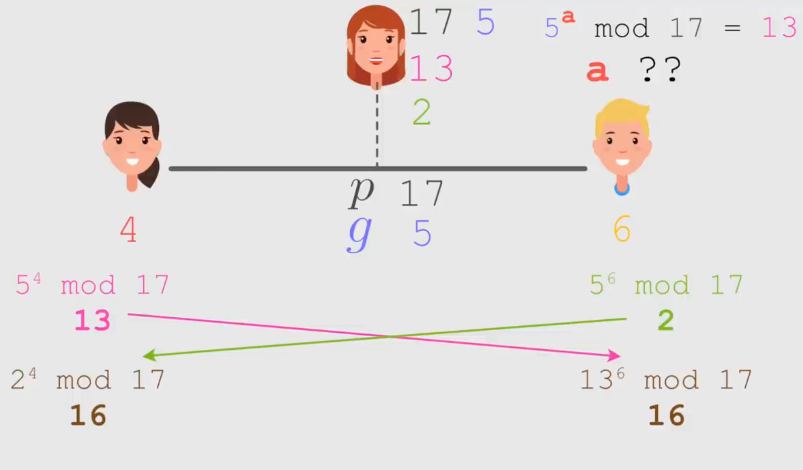

[**L'Algorithme qui Sécurise Internet (entre autres...) - Video Summary**](https://www.youtube.com/watch?v=1Yv8m398Fv0)

[**`00:00`**](https://www.youtube.com/watch?v=1Yv8m398Fv0?t=0)
# Cryptographie et Techniques de Chiffrement

**Aperçu de la Section:** Cette section explore les techniques de chiffrement en cryptographie, mettant en lumière l'algorithme de César, le chiffrement par substitution, et les défis liés à l'échange sécurisé de clés.

## Algorithme de César et Chiffrement par Substitution

- [**`00:54`**](https://www.youtube.com/watch?v=1Yv8m398Fv0?t=54) L'algorithme de César consiste à décaler chaque lettre de l'alphabet d'une quantité fixe pour chiffrer un message.
- [**`01:39`**](https://www.youtube.com/watch?v=1Yv8m398Fv0?t=99) Le chiffrement par substitution remplace chaque lettre par une autre sans logique particulière, offrant des milliards de possibilités.
- [**`02:31`**](https://www.youtube.com/watch?v=1Yv8m398Fv0?t=151) Les chiffrements par substitution peuvent être cassés en analysant les fréquences des lettres dans un message.

## Chiffrement avec Mot-clé

- [**`02:56`**](https://www.youtube.com/watch?v=1Yv8m398Fv0?t=176) Utiliser un mot-clé pour dicter les décalages des lettres dans le message renforce la sécurité du chiffrement.

- [**`03:47`**](https://www.youtube.com/watch?v=1Yv8m398Fv0?t=227) La répétition du mot-clé permet d'avoir des correspondances différentes pour une même lettre, compliquant les attaques statistiques.

# Échange Sécurisé de Clés en Cryptographie

**Aperçu de la Section:** Cette partie aborde le défi crucial d'établir une clé secrète entre deux parties sans risque d'interception.

## Problème de l'Échange de Clés

- [**`04:43`**](https://www.youtube.com/watch?v=1Yv8m398Fv0?t=283) Pour communiquer à distance, il est essentiel que les parties s'accordent sur une clé secrète sans la divulguer explicitement.
- [**`06:24`**](https://www.youtube.com/watch?v=1Yv8m398Fv0?t=384) Définition de la méthode de Diffie-Hellman

**Aperçu de la section:** Dans cette partie, on explore la méthode de Diffie-Hellman pour établir une clé commune sans transmettre explicitement ladite clé.

## Méthode initiale d'échange

- Alice et Bob choisissent un nombre commun, `g = 17`, et des nombres secrets `a` et `b`.

- Ils effectuent des multiplications successives pour générer une clé numérique.
- Les étapes incluent les calculs `g x a`, `g x b`, puis `g x b x a` pour obtenir une **clé commune**.

## Vulnérabilités du premier protocole

- Malgré l'absence de transmission explicite de la clé sur la ligne non sécurisée, Eve peut déduire les nombres secrets en connaissant certains paramètres.
- Eve peut retrouver les nombres secrets d'Alice et Bob en utilisant des opérations simples comme la division.

[**`09:19`**](https://www.youtube.com/watch?v=1Yv8m398Fv0?t=559)
# Amélioration avec l'utilisation des puissances

**Aperçu de la section:** Une variante plus complexe est introduite en remplaçant les multiplications par des puissances pour renforcer la sécurité du protocole.

## Protocole basé sur les puissances

- Alice envoie à Bob le résultat de `g^a`.
- Bob envoie à Alice le résultat de `g^b`.
- Chacun élève ensuite le résultat reçu à sa propre puissance secrète pour obtenir une clé commune.

## Avantages par rapport au premier protocole

- En appliquant des opérations basées sur les puissances et modulo P, Alice et Bob peuvent générer une clé partagée sans exposer leurs nombres secrets explicitement.

[**`10:51`**](https://www.youtube.com/watch?v=1Yv8m398Fv0?t=651)
# Utilisation du modulo dans le protocole Diffie-Hellman

**Aperçu de la section:** L'introduction du modulo dans le processus renforce davantage la sécurité en rendant difficile l'extraction des nombres secrets même avec toutes les informations interceptées.

## Intégration du modulo dans le protocole

- Choix d'un nombre public P pour appliquer le modulo après chaque opération exponentielle.
- Les calculs sont effectués avec modulo P pour masquer davantage les valeurs intermédiaires échangées entre Alice et Bob.

## Résistance aux attaques

[**`13:04`**](https://www.youtube.com/watch?v=1Yv8m398Fv0?t=784)
# Valeurs et Clés Communes

Cette section explique comment Alice et Bob choisissent des nombres secrets, effectuent des calculs modulo pour générer une clé commune, et discute de l'importance de choisir judicieusement les valeurs pour assurer la sécurité.

## Calculs Modulo et Clé Commune

- [**`13:04`**](https://www.youtube.com/watch?v=1Yv8m398Fv0?t=784) Alice choisit 4, Bob choisit 6. Calculs: `5^4 mod 17 = 13, 5^6 mod 17 = 2`.
- [**`13:33`**](https://www.youtube.com/watch?v=1Yv8m398Fv0?t=813) Les interlocuteurs ont une clé commune. Résoudre le problème du logarithme discret est complexe.

- [**`14:00`**](https://www.youtube.com/watch?v=1Yv8m398Fv0?t=840) Le logarithme discret est difficile à résoudre en pratique. Choisir un P grand augmente les possibilités.
- [**`14:51`**](https://www.youtube.com/watch?v=1Yv8m398Fv0?t=891) Illustration avec `P = 15, G = 4`. Limiter les possibilités facilite la tâche de l'attaquant.

[**`16:09`**](https://www.youtube.com/watch?v=1Yv8m398Fv0?t=969)
# Choix de Valeurs Optimal

L'importance de **choisir judicieusement les valeurs `P` et `G`** pour garantir la sécurité dans l'algorithme de Diffie-Hellman.

## Importance du Choix de Valeurs

- [**`16:09`**](https://www.youtube.com/watch?v=1Yv8m398Fv0?t=969) Choisir un **nombre premier `P`** et une **racine primitive `G`** assure un maximum de possibilités.
- [**`16:35`**](https://www.youtube.com/watch?v=1Yv8m398Fv0?t=995) Exemple avec `P = 13`: Racines primitives sont **2**, **6**, **7**, et **11**. Choisir G adéquat est crucial.

Une racine primitive ça veut dire que si vous élevez `G` à toutes les puissance entre `1 et P -1` vous allez trouver tous les nombres possibles entre `1 et P - 1` donc on sera dans un cas où il y aura un maximum de possibilités on peut le voir sur un exemple avec `P = 13` et `G = 6` pour illustrer...

[**`17:00`**](https://www.youtube.com/watch?v=1Yv8m398Fv0?t=1020)
# Sécurité des Communications

L'algorithme de Diffie-Hellman sécurise les communications sur internet malgré quelques vulnérabilités potentielles.

## Sécurité des Communications

- [**`17:00`**](https://www.youtube.com/watch?v=1Yv8m398Fv0?t=1020) Diffie-Hellman largement utilisé pour sécuriser les communications en ligne.

- [**`17:43`**](https://www.youtube.com/watch?v=1Yv8m398Fv0?t=1063) Risques d'usurpation d'identité entre Alice, Bob et Eve doivent être pris en compte.

[**`18:01`**](https://www.youtube.com/watch?v=1Yv8m398Fv0?t=1081)
# Conclusion sur la Sécurité

[**`18:01`**](https://www.youtube.com/watch?v=1Yv8m398Fv0?t=1081) Résumé des précautions à prendre pour assurer la sécurité dans l'échange cryptographique.

## Précautions pour la Sécurité

[**`18:01`**](https://www.youtube.com/watch?v=1Yv8m398Fv0?t=1081) Utiliser un **générateur aléatoire fiable** pour choisir les nombres secrets.

--------

# Apparté

- Diffie-Hellman peut se faire avec n'importe quelle **fonction à sense unique**. En pratique, l’exponentiation modulaire est très utilisés, mais de plus en plus, on utilise les courbes elliptiques car cela permet des clefs plus petites, et des calculs moins gourmand en resources.
- Diffie-Hellman sur les **courbes elliptiques (aka "ECDH")** utilise un analogue direct de Diffie-Hellman classique puisqu'il s'agit du problème du logarithme discret, mais sur les courbes elliptiques, cette fois.
- L'écriture est aussi un peu différente puisque l'exponentiation répétée `g^a` est remplacée par une multiplication scalaire `[a]P`, où `P` est un point sur la courbe.
- D'ailleurs maintenant on n'utilise plus du tout Diffie-Hellman sur les corps finis, tout est passé aux courbes elliptiques pour les raisons évoquées.
- La raison sous-jacente c'est essentiellement que pour résoudre le problème du log discret sur les corps finis, on a des algorithme non-triviaux, par exemple **GNFS (General Number Field Sieve)** alors qu'à ma connaissance, pour le log discret sur les courbes elliptiques on n'a que les algos naïfs.

--------

# Ressources Additionnelles

- [Échange de clés Diffie-Hellman — Wikipédia](https://fr.wikipedia.org/wiki/%C3%89change_de_cl%C3%A9s_Diffie-Hellman)
- [Diffie–Hellman key exchange - Wikipedia](https://en.wikipedia.org/wiki/Diffie%E2%80%93Hellman_key_exchange)

--------

# Transcription

- [00:00:00](https://www.youtube.com/watch?v=1Yv8m398Fv0?t=0) ➜ bonjour à tous aujourd'hui on va parler d'une technique de cryptographie
- [00:00:04](https://www.youtube.com/watch?v=1Yv8m398Fv0?t=4) ➜ incroyable qui permet à deux personnes de s'échanger des secret même quand
- [00:00:09](https://www.youtube.com/watch?v=1Yv8m398Fv0?t=9) ➜ elles sont en permanence écouté par un espion cette méthode qu'on appelle
- [00:00:13](https://www.youtube.com/watch?v=1Yv8m398Fv0?t=13) ➜ l'algorithme de difi Elman paraît assez invraisemblable et les premières fois
- [00:00:18](https://www.youtube.com/watch?v=1Yv8m398Fv0?t=18) ➜ que j'en ai entendu parler je me suis dit que ça n'était pas possible qu'une
- [00:00:22](https://www.youtube.com/watch?v=1Yv8m398Fv0?t=22) ➜ telle technique puisse exister et pourtant on va voir que ça marche
- [00:00:28](https://www.youtube.com/watch?v=1Yv8m398Fv0?t=28) ➜ vraiment si deux personnes souhaitent s'échanger
- [00:00:34](https://www.youtube.com/watch?v=1Yv8m398Fv0?t=34) ➜ un message dans le plus grand secret vous allez me dire que c'est facile he
- [00:00:37](https://www.youtube.com/watch?v=1Yv8m398Fv0?t=37) ➜ il suffit de coder le message techniquement on appelle ça une
- [00:00:40](https://www.youtube.com/watch?v=1Yv8m398Fv0?t=40) ➜ opération de chiffrement on part d'un message en clair par exemple rendez-vous
- [00:00:46](https://www.youtube.com/watch?v=1Yv8m398Fv0?t=46) ➜ ce soir au parc et on va essayer de le transformer en un charabia
- [00:00:50](https://www.youtube.com/watch?v=1Yv8m398Fv0?t=50) ➜ incompréhensible mais qui pourra être déchiffré par notre
- [00:00:54](https://www.youtube.com/watch?v=1Yv8m398Fv0?t=54) ➜ interlocuteur une des plus vieilles techniques c'est ce qu'on appelle le
- [00:00:57](https://www.youtube.com/watch?v=1Yv8m398Fv0?t=57) ➜ décalage de César puisque puisquelle aurait été popularisée par le célèbre
- [00:01:02](https://www.youtube.com/watch?v=1Yv8m398Fv0?t=62) ➜ général romain l'idée est de simplement décaler toutes les lettres de l'alphabet
- [00:01:07](https://www.youtube.com/watch?v=1Yv8m398Fv0?t=67) ➜ d'une certaine quantité par exemple si on décale de 3 on remplace le a par le D
- [00:01:12](https://www.youtube.com/watch?v=1Yv8m398Fv0?t=72) ➜ le B par le E le C par le F et cetera jusqu'au W qui devient Z et X Y Z qui
- [00:01:18](https://www.youtube.com/watch?v=1Yv8m398Fv0?t=78) ➜ deviennent A B et C avec ça le message semble complètement brouillé mais notre
- [00:01:24](https://www.youtube.com/watch?v=1Yv8m398Fv0?t=84) ➜ interlocuteur pourra sans problème le reconstituer en appliquant le décalage
- [00:01:28](https://www.youtube.com/watch?v=1Yv8m398Fv0?t=88) ➜ inverse cette technique est toutefois assez superficielle hein si un espion
- [00:01:33](https://www.youtube.com/watch?v=1Yv8m398Fv0?t=93) ➜ devine que le message a été chiffré de cette façon il n'a que 26 possibilités
- [00:01:37](https://www.youtube.com/watch?v=1Yv8m398Fv0?t=97) ➜ de décalage à essayer et même seulement 25 en fait et donc il aura assez vite
- [00:01:42](https://www.youtube.com/watch?v=1Yv8m398Fv0?t=102) ➜ fait de tout tester jusqu'à découvrir le message secret pour faire plus robuste
- [00:01:47](https://www.youtube.com/watch?v=1Yv8m398Fv0?t=107) ➜ que la méthode de César on peut utiliser ce qu'on appelle le chiffrement par
- [00:01:51](https://www.youtube.com/watch?v=1Yv8m398Fv0?t=111) ➜ substitution ça consiste à remplacer chaque lettre de l'alphabet par une
- [00:01:56](https://www.youtube.com/watch?v=1Yv8m398Fv0?t=116) ➜ autre lettre mais sans logique particulière pour chiffre et déchiffrer
- [00:02:00](https://www.youtube.com/watch?v=1Yv8m398Fv0?t=120) ➜ le message il faut donc connaître l'ensemble de la table de conversion et
- [00:02:05](https://www.youtube.com/watch?v=1Yv8m398Fv0?t=125) ➜ c'est très efficace he car cette fois il y a factoriel 26 possibilités soit de
- [00:02:10](https://www.youtube.com/watch?v=1Yv8m398Fv0?t=130) ➜ l'ordre d'un milliard de milliards de milliards mais malgré ça on sait aussi
- [00:02:15](https://www.youtube.com/watch?v=1Yv8m398Fv0?t=135) ➜ très bien casser ces chiffrements par substitution en faisant des statistiques
- [00:02:19](https://www.youtube.com/watch?v=1Yv8m398Fv0?t=139) ➜ sur les fréquences des lettres et de leurs enchaînements par exemple comme
- [00:02:23](https://www.youtube.com/watch?v=1Yv8m398Fv0?t=143) ➜ c'est toujours la même lettre qui représente le E sur un message en
- [00:02:26](https://www.youtube.com/watch?v=1Yv8m398Fv0?t=146) ➜ français suffisamment long on arrive facilement à l'identifier et idem pour
- [00:02:31](https://www.youtube.com/watch?v=1Yv8m398Fv0?t=151) ➜ des lettres fréquentes comme le a ou le S et ainsi de suite j'avais d'ailleurs
- [00:02:35](https://www.youtube.com/watch?v=1Yv8m398Fv0?t=155) ➜ fait une vidéo sur comment casser ce type de chiffrement très rapidement de
- [00:02:39](https://www.youtube.com/watch?v=1Yv8m398Fv0?t=159) ➜ façon automatisée en utilisant ce qu'on appelle des méthodes de Monte Carlo par
- [00:02:43](https://www.youtube.com/watch?v=1Yv8m398Fv0?t=163) ➜ chaîne de Markov pour se prémunir de ces attaques il faut essayer un autre type
- [00:02:49](https://www.youtube.com/watch?v=1Yv8m398Fv0?t=169) ➜ de chiffrement une option c'est par exemple d'utiliser un mot- clé qui va
- [00:02:53](https://www.youtube.com/watch?v=1Yv8m398Fv0?t=173) ➜ dicter les décalages de lettres prenons le mot jardin et écrivons-le en dessous
- [00:02:59](https://www.youtube.com/watch?v=1Yv8m398Fv0?t=179) ➜ de notre message chacune des lettres du mot va représenter un décalage en
- [00:03:03](https://www.youtube.com/watch?v=1Yv8m398Fv0?t=183) ➜ fonction de sa position dans l'alphabet le J c'est neu le a c'est 0 le r C'est
- [00:03:08](https://www.youtube.com/watch?v=1Yv8m398Fv0?t=188) ➜ 17 et cetera et on applique ensuite chaque décalage aux lettres de notre
- [00:03:13](https://www.youtube.com/watch?v=1Yv8m398Fv0?t=193) ➜ message le r on décale de 9 ça fait un a le E on décale de 0 ça fait un e le N on
- [00:03:20](https://www.youtube.com/watch?v=1Yv8m398Fv0?t=200) ➜ décale de 17 ça devient aussi un E et cetera et on répète le mot-cé autant de
- [00:03:25](https://www.youtube.com/watch?v=1Yv8m398Fv0?t=205) ➜ fois que nécessaire jusqu'à avoir tout fait si la personne qui reçoit le
- [00:03:30](https://www.youtube.com/watch?v=1Yv8m398Fv0?t=210) ➜ message possède la clé ça ne pose pas de problème pour elle il suffit de
- [00:03:34](https://www.youtube.com/watch?v=1Yv8m398Fv0?t=214) ➜ soustraire les décalages l'intérêt de cette méthode vous le voyez c'est que
- [00:03:38](https://www.youtube.com/watch?v=1Yv8m398Fv0?t=218) ➜ les deux e du message d'origine seront représentés par des lettres différentes
- [00:03:42](https://www.youtube.com/watch?v=1Yv8m398Fv0?t=222) ➜ dans le message chiffré et inversement la même lettre dans le message chiffré
- [00:03:47](https://www.youtube.com/watch?v=1Yv8m398Fv0?t=227) ➜ peut représenter deux lettres différentes dans le message d'origine et
- [00:03:51](https://www.youtube.com/watch?v=1Yv8m398Fv0?t=231) ➜ cela va donc considérablement gêner les attaques utilisant des approches
- [00:03:55](https://www.youtube.com/watch?v=1Yv8m398Fv0?t=235) ➜ statistiques pour que la méthode soit assez robuste il faut bien sûr utiliser
- [00:03:59](https://www.youtube.com/watch?v=1Yv8m398Fv0?t=239) ➜ un mot clé suffisamment long mais ça n'a même pas besoin d'être un vrai mot en
- [00:04:03](https://www.youtube.com/watch?v=1Yv8m398Fv0?t=243) ➜ fait hein ça peut être simplement une longue suite de lettres prises au hasard
- [00:04:08](https://www.youtube.com/watch?v=1Yv8m398Fv0?t=248) ➜ qu'on appellera alors la clé de chiffrement elle permettra à la fois à
- [00:04:12](https://www.youtube.com/watch?v=1Yv8m398Fv0?t=252) ➜ l'envoyeur de chiffrer son message et au destinataire de le
- [00:04:16](https://www.youtube.com/watch?v=1Yv8m398Fv0?t=256) ➜ déchiffrer le gros problème de cette technique c'est que si deux personnes
- [00:04:21](https://www.youtube.com/watch?v=1Yv8m398Fv0?t=261) ➜ souhaitent communiquer ainsi elles doivent à un moment donné se mettre
- [00:04:25](https://www.youtube.com/watch?v=1Yv8m398Fv0?t=265) ➜ d'accord sur la clé à utiliser alors si c'est la CIA qui envoie un agent sur le
- [00:04:30](https://www.youtube.com/watch?v=1Yv8m398Fv0?t=270) ➜ terrain ben il y a pas de problème he ils peuvent convenir d'une clé à
- [00:04:32](https://www.youtube.com/watch?v=1Yv8m398Fv0?t=272) ➜ l'avance avant le départ mais si on a deux personnes à
- [00:04:41](https://www.youtube.com/watch?v=1Yv8m398Fv0?t=281) ➜ distance qui n'ont pas la possibilité de se voir physiquement si on ne fait que
- [00:04:45](https://www.youtube.com/watch?v=1Yv8m398Fv0?t=285) ➜ se téléphoner ou s'envoyer des messages par internet comment se fixer une clé de
- [00:04:51](https://www.youtube.com/watch?v=1Yv8m398Fv0?t=291) ➜ chiffrement qui soit secrète on peut pas avoir juste un des deux qui décide d'une
- [00:04:56](https://www.youtube.com/watch?v=1Yv8m398Fv0?t=296) ➜ clé et puis qui écrivent à l'autre bah on a qu'à utiliser la clé bateau parce
- [00:05:01](https://www.youtube.com/watch?v=1Yv8m398Fv0?t=301) ➜ que si ce message là est intercepté et bien l'espion connaîtra la clé
- [00:05:04](https://www.youtube.com/watch?v=1Yv8m398Fv0?t=304) ➜ évidemment il faut donc trouver un moyen de se mettre d'accord sur une clé mais
- [00:05:09](https://www.youtube.com/watch?v=1Yv8m398Fv0?t=309) ➜ sans jamais vraiment l'écrire explicitement c'est ce qu'on appelle le
- [00:05:14](https://www.youtube.com/watch?v=1Yv8m398Fv0?t=314) ➜ problème de l'échange de clé ou de l'établissement de clés comment se
- [00:05:18](https://www.youtube.com/watch?v=1Yv8m398Fv0?t=318) ➜ mettre d'accord à distance sur une clé de chiffrement commune sachant qu'on est
- [00:05:24](https://www.youtube.com/watch?v=1Yv8m398Fv0?t=324) ➜ potentiellement écouté en permanence à première vue ça paraît quasi impossible
- [00:05:29](https://www.youtube.com/watch?v=1Yv8m398Fv0?t=329) ➜ à résoudre si on a aucun moyen d'échanger des infos secrètement comment
- [00:05:34](https://www.youtube.com/watch?v=1Yv8m398Fv0?t=334) ➜ est-ce qu'on pourrait se mettre d'accord à distance sur une même clé sans qu'un
- [00:05:37](https://www.youtube.com/watch?v=1Yv8m398Fv0?t=337) ➜ curieux ne puisse la connaître aussi et bien c'est ce problème qu'ont résolu les
- [00:05:43](https://www.youtube.com/watch?v=1Yv8m398Fv0?t=343) ➜ mathématiciens difi et Elman en 1976 alors classiquement en cryptographie on
- [00:05:49](https://www.youtube.com/watch?v=1Yv8m398Fv0?t=349) ➜ décrit les choses de la façon suivante imaginons deux personnes
- [00:05:53](https://www.youtube.com/watch?v=1Yv8m398Fv0?t=353) ➜ traditionnellement nommé alice et Bob qui ne se sont jamais vu ou parler
- [00:05:57](https://www.youtube.com/watch?v=1Yv8m398Fv0?t=357) ➜ auparavant mais qui peuvent communiquer à distance sur une ligne qui n'est pas
- [00:06:02](https://www.youtube.com/watch?v=1Yv8m398Fv0?t=362) ➜ sécurisée et d'ailleurs on a une personne usuellement nommée
- [00:06:06](https://www.youtube.com/watch?v=1Yv8m398Fv0?t=366) ➜ qui s'est justement brancher sur cette ligne et qui peut capter absolument tout
- [00:06:10](https://www.youtube.com/watch?v=1Yv8m398Fv0?t=370) ➜ ce qui va s'y raconter comment alice et Bob peuvent se mettre d'accord sur une
- [00:06:16](https://www.youtube.com/watch?v=1Yv8m398Fv0?t=376) ➜ clé commune sans qu'ev ne puisse connaître cette clé ça paraît impossible
- [00:06:22](https://www.youtube.com/watch?v=1Yv8m398Fv0?t=382) ➜ alors petite précision avant de commencer dans la méthode de difi Elman
- [00:06:26](https://www.youtube.com/watch?v=1Yv8m398Fv0?t=386) ➜ la clé ne sera pas un mot ou une suite de lettres mais un nombre mais dans le
- [00:06:30](https://www.youtube.com/watch?v=1Yv8m398Fv0?t=390) ➜ fond ça change pas grand-chose hein c'est très facile de fabriquer l'un à
- [00:06:34](https://www.youtube.com/watch?v=1Yv8m398Fv0?t=394) ➜ partir de l'autre pour vous montrer comment alice et Bob peuvent procéder
- [00:06:38](https://www.youtube.com/watch?v=1Yv8m398Fv0?t=398) ➜ pour décider d'une clé numérique je vais commencer doucement par une méthode qui
- [00:06:43](https://www.youtube.com/watch?v=1Yv8m398Fv0?t=403) ➜ ne marche pas mais qui va nous mettre sur la voix imaginons qu'Alice et Bob
- [00:06:48](https://www.youtube.com/watch?v=1Yv8m398Fv0?t=408) ➜ s'appellent et décident ensemble d'un nombre de base qu'on va appeler g
- [00:06:52](https://www.youtube.com/watch?v=1Yv8m398Fv0?t=412) ➜ maisons il choisissent g = 17 et évidemment la ligne n'est pas sécurisée
- [00:06:57](https://www.youtube.com/watch?v=1Yv8m398Fv0?t=417) ➜ donc EV entend tout et enregistre cette valeur de G ensuite alice et Bob
- [00:07:03](https://www.youtube.com/watch?v=1Yv8m398Fv0?t=423) ➜ choisissent chacun de leur côté un nombre secret qu'on note a pour Alice et
- [00:07:08](https://www.youtube.com/watch?v=1Yv8m398Fv0?t=428) ➜ B pour Bob il vut ensuite chacun multiplier leur nombre secret par le
- [00:07:13](https://www.youtube.com/watch?v=1Yv8m398Fv0?t=433) ➜ nombre commun g Alice fabriquera donc le nombre g X a et Bob g x B si Alice
- [00:07:19](https://www.youtube.com/watch?v=1Yv8m398Fv0?t=439) ➜ choisit 4 et Bob 6 ça fera 68 et 102 puis il communique à l'autre le
- [00:07:26](https://www.youtube.com/watch?v=1Yv8m398Fv0?t=446) ➜ résultat de cette multiplication donc Alice envoie g X a à Bob qui lui envoie
- [00:07:32](https://www.youtube.com/watch?v=1Yv8m398Fv0?t=452) ➜ g x B et cela se fait sans sécurisation donc là à nouveau est au courant de ses
- [00:07:37](https://www.youtube.com/watch?v=1Yv8m398Fv0?t=457) ➜ valeurs et enfin dernière étape chacun multiplie ce nombre qu'il vient de
- [00:07:42](https://www.youtube.com/watch?v=1Yv8m398Fv0?t=462) ➜ recevoir par son propre nombre secret Alice fabrique donc le nombre g x B X a
- [00:07:48](https://www.youtube.com/watch?v=1Yv8m398Fv0?t=468) ➜ ça fera 408 et Bob g X a x B ça fera 408 aussi évidemment et voilà ils peuvent
- [00:07:54](https://www.youtube.com/watch?v=1Yv8m398Fv0?t=474) ➜ maintenant décider d'utiliser ce résultat commun comme clé de chiffrement
- [00:07:59](https://www.youtube.com/watch?v=1Yv8m398Fv0?t=479) ➜ vous voyez qu'avec ce protocole ils auront bien à la fin chacun le même
- [00:08:03](https://www.youtube.com/watch?v=1Yv8m398Fv0?t=483) ➜ nombre g X a x B ils se sont donc bien mis d'accord sur une clé commune mais
- [00:08:09](https://www.youtube.com/watch?v=1Yv8m398Fv0?t=489) ➜ sans qu'à aucun moment cette clé n'ê explicitement transité sur la ligne non
- [00:08:14](https://www.youtube.com/watch?v=1Yv8m398Fv0?t=494) ➜ sécurisée aucun moment ils n'ont communiqué l'un à l'autre le nombre
- [00:08:18](https://www.youtube.com/watch?v=1Yv8m398Fv0?t=498) ➜ 408 alors le souci vous le voyez hein c'est keV connaît g c'est 17 mais
- [00:08:24](https://www.youtube.com/watch?v=1Yv8m398Fv0?t=504) ➜ connait également g X a 68 et G x B 102 bah à partir de là c'est très facile
- [00:08:29](https://www.youtube.com/watch?v=1Yv8m398Fv0?t=509) ➜ pour elle de retrouver les nombres secrets d'Alice et Bob par exemple a
- [00:08:34](https://www.youtube.com/watch?v=1Yv8m398Fv0?t=514) ➜ s'obtient en divisant g par G ici 68 par 17 on retrouve 4 et donc F pourra sans
- [00:08:40](https://www.youtube.com/watch?v=1Yv8m398Fv0?t=520) ➜ problème reconstituer elle-même la clé complète donc la méthode que je viens de
- [00:08:45](https://www.youtube.com/watch?v=1Yv8m398Fv0?t=525) ➜ proposer n'est pas terrible hein car même si la clé ne transite pas
- [00:08:49](https://www.youtube.com/watch?v=1Yv8m398Fv0?t=529) ➜ explicitement EV a suffisamment d'informations pour la refabriquer
- [00:08:53](https://www.youtube.com/watch?v=1Yv8m398Fv0?t=533) ➜ facilement pour essayer de contourner ce problème essayons une variante plus
- [00:08:57](https://www.youtube.com/watch?v=1Yv8m398Fv0?t=537) ➜ compliquée on garde le nombre commun g et les nombres secrets A et B mais cette
- [00:09:03](https://www.youtube.com/watch?v=1Yv8m398Fv0?t=543) ➜ fois on va prendre la puissance au lieu de faire la
- [00:09:06](https://www.youtube.com/watch?v=1Yv8m398Fv0?t=546) ➜ multiplication ça veut dire qu'Alice fabrique le nombre g^iss a qu'elle
- [00:09:10](https://www.youtube.com/watch?v=1Yv8m398Fv0?t=550) ➜ envoie à Bob et Bob fabrique g^iss B qu'il lui envoie en retour et ensuite
- [00:09:17](https://www.youtube.com/watch?v=1Yv8m398Fv0?t=557) ➜ chacun prend la puissance avec son propre nombre secret donc Alice fait
- [00:09:21](https://www.youtube.com/watch?v=1Yv8m398Fv0?t=561) ➜ g^iss B puissance a tantis que Bob fait g^iss a puissance B et à nouveau avec ce
- [00:09:27](https://www.youtube.com/watch?v=1Yv8m398Fv0?t=567) ➜ protocole ils auront à la fin le même résultat g^issance a x B donc une clé
- [00:09:33](https://www.youtube.com/watch?v=1Yv8m398Fv0?t=573) ➜ commune sans l'avoir jamais explicitement communiqué sur la ligne F
- [00:09:37](https://www.youtube.com/watch?v=1Yv8m398Fv0?t=577) ➜ de son côté connaît seulement ce qu'elle a intercepté à savoir g g^iss A et g^iss
- [00:09:42](https://www.youtube.com/watch?v=1Yv8m398Fv0?t=582) ➜ B sauf qu'à nouveau elle peut s'en sortir rien qu'avec ses infos si f
- [00:09:48](https://www.youtube.com/watch?v=1Yv8m398Fv0?t=588) ➜ connaît le nombre g puissance a elle peut prendre son logarithme qui vaut a x
- [00:09:53](https://www.youtube.com/watch?v=1Yv8m398Fv0?t=593) ➜ logarithme g et ensuite en divisant par le logarithme de G elle peut isoler a
- [00:09:59](https://www.youtube.com/watch?v=1Yv8m398Fv0?t=599) ➜ donc à nouveau elle peut reconstituer facilement les nombres secrets et donc
- [00:10:03](https://www.youtube.com/watch?v=1Yv8m398Fv0?t=603) ➜ la clé commune ça va toujours pas l'origine fondamentale du problème c'est
- [00:10:08](https://www.youtube.com/watch?v=1Yv8m398Fv0?t=608) ➜ qu'Alice et Bob essayent à chaque fois de maquiller leur nombre secret en le
- [00:10:13](https://www.youtube.com/watch?v=1Yv8m398Fv0?t=613) ➜ mélangeant en quelque sorte avec G mais à chaque fois F peut défaire ce mélange
- [00:10:18](https://www.youtube.com/watch?v=1Yv8m398Fv0?t=618) ➜ et retrouver les nombres secrets si on utilise la multiplication F peut
- [00:10:22](https://www.youtube.com/watch?v=1Yv8m398Fv0?t=622) ➜ utiliser la division si on utilise la puissance EV utilise le logarithme pour
- [00:10:27](https://www.youtube.com/watch?v=1Yv8m398Fv0?t=627) ➜ que l'idée fonctionne il faudrait une opération de mélange qui soit facile à
- [00:10:31](https://www.youtube.com/watch?v=1Yv8m398Fv0?t=631) ➜ faire pour alice et Bob mais quasi impossible à inverser pour
- [00:10:35](https://www.youtube.com/watch?v=1Yv8m398Fv0?t=635) ➜ c'est ce qu'on appelle en cryptographie une fonction à sens unique et bien on
- [00:10:39](https://www.youtube.com/watch?v=1Yv8m398Fv0?t=639) ➜ peut justement en créer une à partir de notre tentative précédente en ajoutant
- [00:10:44](https://www.youtube.com/watch?v=1Yv8m398Fv0?t=644) ➜ juste un ingrédient le modulo le modulo c'est une opération qui
- [00:10:54](https://www.youtube.com/watch?v=1Yv8m398Fv0?t=654) ➜ calcule le reste de la division entière par un nombre par exemple 17 modulo 3 ça
- [00:10:59](https://www.youtube.com/watch?v=1Yv8m398Fv0?t=659) ➜ fait 2 parce que si vous faites la division entière de 17 par 3 vous
- [00:11:03](https://www.youtube.com/watch?v=1Yv8m398Fv0?t=663) ➜ trouvez 5 il vous reste 2 à la fin de même 14 modulo 5 ça fait 4 ou encore 42
- [00:11:09](https://www.youtube.com/watch?v=1Yv8m398Fv0?t=669) ➜ modulo 6 ça fait 0 et cetera l'idée de la méthode de difi Elman c'est de
- [00:11:14](https://www.youtube.com/watch?v=1Yv8m398Fv0?t=674) ➜ choisir un nombre P qu'Alice et Bob se communique publiquement comme j'ai et
- [00:11:19](https://www.youtube.com/watch?v=1Yv8m398Fv0?t=679) ➜ ensuite de faire exactement comme dans mon exemple avec les puissances mais
- [00:11:23](https://www.youtube.com/watch?v=1Yv8m398Fv0?t=683) ➜ cette fois après chaque opération on va appliquer module op c'est-à-dire qu'avec
- [00:11:28](https://www.youtube.com/watch?v=1Yv8m398Fv0?t=688) ➜ son nombre secret a Alice calcule g^iss a moduo P et l'envoie à Bob Bob de son
- [00:11:36](https://www.youtube.com/watch?v=1Yv8m398Fv0?t=696) ➜ côté calcule g^iss B module P et l'envoie à Alice et ensuite chacun
- [00:11:41](https://www.youtube.com/watch?v=1Yv8m398Fv0?t=701) ➜ applique la puissance de son nombre secret et prend à nouveau moduo op et là
- [00:11:47](https://www.youtube.com/watch?v=1Yv8m398Fv0?t=707) ➜ ça ne se voit pas forcément mais en faisant ça ils auront exactement le même
- [00:11:51](https://www.youtube.com/watch?v=1Yv8m398Fv0?t=711) ➜ nombre à la fin qui est en fait g^iss a x B module P d'ailleurs ceux qui font ê
- [00:11:57](https://www.youtube.com/watch?v=1Yv8m398Fv0?t=717) ➜ expert en terminal peent peuvent essayer de démontrer ça avec les congruences
- [00:12:02](https://www.youtube.com/watch?v=1Yv8m398Fv0?t=722) ➜ grâce à cette technique qui est presque la même que la précédente mais en
- [00:12:06](https://www.youtube.com/watch?v=1Yv8m398Fv0?t=726) ➜ appliquant le module op après chaque opération alice et Bob auront à nouveau
- [00:12:10](https://www.youtube.com/watch?v=1Yv8m398Fv0?t=730) ➜ réussi à se mettre d'accord sur une clé commune sans jamais la faire circuler
- [00:12:15](https://www.youtube.com/watch?v=1Yv8m398Fv0?t=735) ➜ explicitement sauf que pour Eve qu'est-ce que ça change est-ce qu'elle
- [00:12:19](https://www.youtube.com/watch?v=1Yv8m398Fv0?t=739) ➜ peut pas à nouveau extraire A ou B des infos dont elle dispose et reconstituer
- [00:12:24](https://www.youtube.com/watch?v=1Yv8m398Fv0?t=744) ➜ la clé comme avant et bien non car pour quelqu'un qui intercepte même toutes les
- [00:12:30](https://www.youtube.com/watch?v=1Yv8m398Fv0?t=750) ➜ conversations ça devient très très compliqué à démêler à cause du modulo
- [00:12:35](https://www.youtube.com/watch?v=1Yv8m398Fv0?t=755) ➜ qui en quelque sorte mélange tout mathématiquement même en connaissant g P
- [00:12:41](https://www.youtube.com/watch?v=1Yv8m398Fv0?t=761) ➜ et g^iss à moduo P il est très difficile de retrouver a l'opération de puissance
- [00:12:48](https://www.youtube.com/watch?v=1Yv8m398Fv0?t=768) ➜ avec MODULO est très difficile à inverser c'est une opération à sens
- [00:12:52](https://www.youtube.com/watch?v=1Yv8m398Fv0?t=772) ➜ unique comme on le souhaitait on peut le voir sur un exemple si vous voulez
- [00:12:55](https://www.youtube.com/watch?v=1Yv8m398Fv0?t=775) ➜ prenons P = 17 et G = 5 sur lesquel alice et Bob se mettent d'accord
- [00:13:01](https://www.youtube.com/watch?v=1Yv8m398Fv0?t=781) ➜ publiquement donc est parfaitement au courant de ces deux
- [00:13:04](https://www.youtube.com/watch?v=1Yv8m398Fv0?t=784) ➜ valeurs Alice choisit son nombre secret disons 4 et Bob choisit 6 Alice met 5 à
- [00:13:12](https://www.youtube.com/watch?v=1Yv8m398Fv0?t=792) ➜ la puissance 4 ça fait 625 et prend modulo 17 il reste 13 pareil pour Bob il
- [00:13:18](https://www.youtube.com/watch?v=1Yv8m398Fv0?t=798) ➜ calcule 5^ 6 prend modulo 17 ça fait 2 et chacun envoie le résultat à l'autre
- [00:13:24](https://www.youtube.com/watch?v=1Yv8m398Fv0?t=804) ➜ qui applique sa propre puissance Alice prend 2^iss 4 module 10 ça fait 16 Bob
- [00:13:30](https://www.youtube.com/watch?v=1Yv8m398Fv0?t=810) ➜ fait 13 puiss 6 modulo 17 ça fait 16 aussi on a donc bien une clé commune
- [00:13:36](https://www.youtube.com/watch?v=1Yv8m398Fv0?t=816) ➜ pour les deux interlocuteur de son côté F connaît P = 17 et G = 5 bien sûr mais
- [00:13:43](https://www.youtube.com/watch?v=1Yv8m398Fv0?t=823) ➜ ne dispose que de 13 et 2 comme intermédiaire pour retrouver par exemple
- [00:13:48](https://www.youtube.com/watch?v=1Yv8m398Fv0?t=828) ➜ a le nombre secret d'Alice elle doit trouver un nombre qui quand on
- [00:13:52](https://www.youtube.com/watch?v=1Yv8m398Fv0?t=832) ➜ l'applique en puissance à 5 redonne 13 modulo 17 et ça n'a pas l'air comme ça
- [00:13:58](https://www.youtube.com/watch?v=1Yv8m398Fv0?t=838) ➜ mais mais c'est très difficile comme équation l'opération qu'on doit résoudre
- [00:14:02](https://www.youtube.com/watch?v=1Yv8m398Fv0?t=842) ➜ pour trouver la solution c'est ce qu'on appelle le problème du logarithme
- [00:14:06](https://www.youtube.com/watch?v=1Yv8m398Fv0?t=846) ➜ discret dans ma méthode précédente avec juste les puissances F s'en sortait en
- [00:14:10](https://www.youtube.com/watch?v=1Yv8m398Fv0?t=850) ➜ appliquant un simple logarithme maintenant à cause du modulo il faut
- [00:14:15](https://www.youtube.com/watch?v=1Yv8m398Fv0?t=855) ➜ résoudre le logarithme discret ce qui est possible en théorie mais très très
- [00:14:19](https://www.youtube.com/watch?v=1Yv8m398Fv0?t=859) ➜ fastidieux en pratique il faut quasiment essayer toutes les possibilités alors je
- [00:14:25](https://www.youtube.com/watch?v=1Yv8m398Fv0?t=865) ➜ dis que c'est très compliqué il faut quand même faire un peu attention quand
- [00:14:28](https://www.youtube.com/watch?v=1Yv8m398Fv0?t=868) ➜ on prend un nombre modulo p le résultat est forcément entre 0 et P -1 c'est le
- [00:14:34](https://www.youtube.com/watch?v=1Yv8m398Fv0?t=874) ➜ reste d'une division entière donc si on veut qu'il y ait un maximum de
- [00:14:39](https://www.youtube.com/watch?v=1Yv8m398Fv0?t=879) ➜ possibilités différentes à tester pour EV il faut déjà prendre un P le plus
- [00:14:43](https://www.youtube.com/watch?v=1Yv8m398Fv0?t=883) ➜ grand possible ça n'est pas tout il faut aussi bien le choisir et surtout bien
- [00:14:48](https://www.youtube.com/watch?v=1Yv8m398Fv0?t=888) ➜ choisir le G qui va avec je vous illustre ça avec un exemple si je prends
- [00:14:54](https://www.youtube.com/watch?v=1Yv8m398Fv0?t=894) ➜ P = 15 et G = 4 on sait que la clé sera à la fin fin g^iss Ab module P donc
- [00:15:01](https://www.youtube.com/watch?v=1Yv8m398Fv0?t=901) ➜ g^issance quelque chose module P et on peut regarder ce que valent les
- [00:15:06](https://www.youtube.com/watch?v=1Yv8m398Fv0?t=906) ➜ différentes puissance de G module P avec mon choix de valeur g^iss 1 module P
- [00:15:11](https://www.youtube.com/watch?v=1Yv8m398Fv0?t=911) ➜ c'est 4 g^ 2 module P c'est 1 g^iss 3 module P c'est 4 g^ 4 module P c'est 1
- [00:15:18](https://www.youtube.com/watch?v=1Yv8m398Fv0?t=918) ➜ et cetera on se rend compte que bien qu'on ait choisi P = 15 les puissances
- [00:15:23](https://www.youtube.com/watch?v=1Yv8m398Fv0?t=923) ➜ de G tombent toujours sur 1 ou 4 donc on croyait avoir 15 clés possibles que F
- [00:15:29](https://www.youtube.com/watch?v=1Yv8m398Fv0?t=929) ➜ devait essayer mais on en a seulement deux il faut absolument éviter ce genre
- [00:15:34](https://www.youtube.com/watch?v=1Yv8m398Fv0?t=934) ➜ de situation car en réduisant ainsi l'espace des possibilités on facilite
- [00:15:39](https://www.youtube.com/watch?v=1Yv8m398Fv0?t=939) ➜ considérablement la tâche devev qui cherche à percer notre clé heureusement
- [00:15:44](https://www.youtube.com/watch?v=1Yv8m398Fv0?t=944) ➜ il existe une solution l'idéal c'est de prendre un nombre P qui soit premier et
- [00:15:50](https://www.youtube.com/watch?v=1Yv8m398Fv0?t=950) ➜ un nombre G qui soit ce qu'on appelle une racine primitive module op une
- [00:15:55](https://www.youtube.com/watch?v=1Yv8m398Fv0?t=955) ➜ racine primitive ça veut dire que si vous élevez g à toutes les puiss
- [00:15:58](https://www.youtube.com/watch?v=1Yv8m398Fv0?t=958) ➜ puissance entre 1 et P -1 vous allez trouver tous les nombres possibles entre
- [00:16:03](https://www.youtube.com/watch?v=1Yv8m398Fv0?t=963) ➜ 1 et P - 1 donc on sera dans un cas où il y aura un maximum de possibilités on
- [00:16:09](https://www.youtube.com/watch?v=1Yv8m398Fv0?t=969) ➜ peut le voir sur un exemple avec P = 13 par exemple je vous le démontre pas mais
- [00:16:13](https://www.youtube.com/watch?v=1Yv8m398Fv0?t=973) ➜ les racines primitif sont uniquement 2 6 7 et 11 donc si on prend g = 6 les
- [00:16:20](https://www.youtube.com/watch?v=1Yv8m398Fv0?t=980) ➜ puissances de 6 modulo 13 s'étalent bien entre 1 et 12 c'est parfait mais avec G
- [00:16:25](https://www.youtube.com/watch?v=1Yv8m398Fv0?t=985) ➜ = 5 ça marche pas bien car les puissances ne boucle que sur 5 12 8 et 1
- [00:16:31](https://www.youtube.com/watch?v=1Yv8m398Fv0?t=991) ➜ donc il y a seulement quatre possibilités au lieu de 12 d'où
- [00:16:35](https://www.youtube.com/watch?v=1Yv8m398Fv0?t=995) ➜ l'intérêt qu'il y a à bien choisir pour G une racine primitive du nombre P qu'on
- [00:16:40](https://www.youtube.com/watch?v=1Yv8m398Fv0?t=1000) ➜ a sélectionné avec ces petites précautions on a ainsi l'essence de
- [00:16:45](https://www.youtube.com/watch?v=1Yv8m398Fv0?t=1005) ➜ l'algorithme de DII Elman qui résout donc le problème de la détermination
- [00:16:49](https://www.youtube.com/watch?v=1Yv8m398Fv0?t=1009) ➜ d'une clé de chiffrement commune quand on est sur un canal public cet
- [00:16:54](https://www.youtube.com/watch?v=1Yv8m398Fv0?t=1014) ➜ algorithme a été d'abord publié en 1976 et breeveté aux États-Unis l'année
- [00:16:58](https://www.youtube.com/watch?v=1Yv8m398Fv0?t=1018) ➜ suivante mais heureusement il est maintenant dans le domaine public et il
- [00:17:02](https://www.youtube.com/watch?v=1Yv8m398Fv0?t=1022) ➜ est très largement utilisé pour sécuriser une grande partie des
- [00:17:05](https://www.youtube.com/watch?v=1Yv8m398Fv0?t=1025) ➜ communications sur internet ainsi quand deux ordinateurs ont besoin de mettre en
- [00:17:10](https://www.youtube.com/watch?v=1Yv8m398Fv0?t=1030) ➜ place un canal de communication chiffré pour ne pas que vos données soient
- [00:17:13](https://www.youtube.com/watch?v=1Yv8m398Fv0?t=1033) ➜ diffusées en clair sur le réseau ils utilisent souvent une variante de
- [00:17:17](https://www.youtube.com/watch?v=1Yv8m398Fv0?t=1037) ➜ l'algorithme de difi Elman et c'est d'ailleurs ce principe qui sécurise
- [00:17:21](https://www.youtube.com/watch?v=1Yv8m398Fv0?t=1041) ➜ notamment le protocole TLS qui se trouve derrière la plupart des visites que vous
- [00:17:26](https://www.youtube.com/watch?v=1Yv8m398Fv0?t=1046) ➜ pouvez faire sur des sites web donc merci difi et Elman malgré tout comme
- [00:17:31](https://www.youtube.com/watch?v=1Yv8m398Fv0?t=1051) ➜ toujours la méthode n'est pas non plus totalement inviolable par exemple il
- [00:17:36](https://www.youtube.com/watch?v=1Yv8m398Fv0?t=1056) ➜ faut faire attention à ce qu'ev n'arrive pas à usurper les identités d'Alice et
- [00:17:40](https://www.youtube.com/watch?v=1Yv8m398Fv0?t=1060) ➜ Bob ça lui permettrait de se mettre entre les deux en se faisant passer pour
- [00:17:45](https://www.youtube.com/watch?v=1Yv8m398Fv0?t=1065) ➜ Bob aux yeux d'Alice et inversement et là c'est open bar pour Eve en dehors de
- [00:17:50](https://www.youtube.com/watch?v=1Yv8m398Fv0?t=1070) ➜ ce risque il faut aussi s'assurer que quand alice et Bob choisissent chacun
- [00:17:54](https://www.youtube.com/watch?v=1Yv8m398Fv0?t=1074) ➜ leur nombre secret de leur côté ne puisse pas le deviner facilement et
- [00:17:59](https://www.youtube.com/watch?v=1Yv8m398Fv0?t=1079) ➜ donc idéalement il faut qu'ils fassent leur choix en utilisant un bon
- [00:18:03](https://www.youtube.com/watch?v=1Yv8m398Fv0?t=1083) ➜ générateur de nombre aléatoire et d'ailleurs cette question de comment
- [00:18:08](https://www.youtube.com/watch?v=1Yv8m398Fv0?t=1088) ➜ faire un générateur aléatoire je me dis que ça ferait un très bon sujet pour un
- [00:18:12](https://www.youtube.com/watch?v=1Yv8m398Fv0?t=1092) ➜ prochain épisode merci d'avoir suivi la vidéo abonnez-vous pour ne rien rater
- [00:18:16](https://www.youtube.com/watch?v=1Yv8m398Fv0?t=1096) ➜ des futures publications rejoignez-moi sur le discord de science étonnante je
- [00:18:19](https://www.youtube.com/watch?v=1Yv8m398Fv0?t=1099) ➜ vous mets le lien en description et puis je vous dis à très vite pour une
- [00:18:23](https://www.youtube.com/watch?v=1Yv8m398Fv0?t=1103) ➜ nouvelle vidéo à bientôt.

